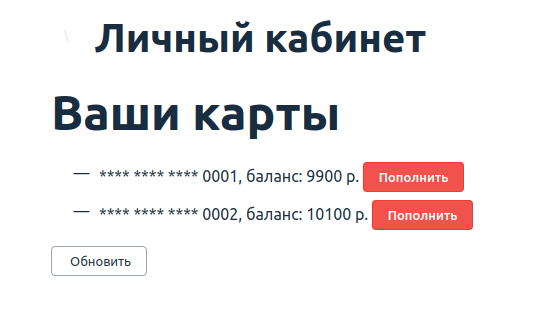
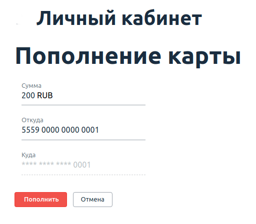

**Задача №1: Page Object's**

Вам необходимо добить тестирование функции перевода с карты на карту. Разработчики пока реализовали возможность перевода только между своими картами, но уже хотят, чтобы вы всё протестировали.

Для этого они не поленились и захардкодили вам целого одного пользователя:
* login: 'vasya'
* password: 'qwerty123'
* verification code (hardcoded): '12345'
* cards:
    * first:
        * number: '5559 0000 0000 0001'
        * balance: 10 000 RUB
    * second:
        * number: '5559 0000 0000 0002'
        * balance: 10 000 RUB

После логина, который уже мы сделали на лекции, вы получите список карт:

Нажав на кнопку «Пополнить», вы перейдёте на страницу перевода средств:

При успешном переводе вы вернётесь назад на страницу со списком карт.

Это ключевой кейс, который нужно протестировать.

Нужно, чтобы вы через Page Object's добавили доменные методы:

- перевода с определённой карты на другую карту энной суммы,
- проверки баланса по карте со страницы списка карт.

Вы можете познакомиться с некоторыми подсказками https://github.com/netology-code/aqa-homeworks/blob/master/bdd/balance.md

- Обратите внимание на то, что ваши тесты должны проходить целиком, то есть весь набор тестов.
- Не закладывайтесь на то, что на картах для каждого теста всегда одна и та же фиксированная сумма, подумайте, как работать с SUT так, чтобы не приходилось её перезапускать для каждого теста.

**Задача №2: BDD (необязательная)** 

Используя Page Object's из предыдущей задачи, на базе шаблона Cucumber с лекции реализуйте кастомные steps:

- когда пользователь переводит 5 000 рублей с карты с номером 5559 0000 0000 0002 на свою 1 карту с главной страницы,
- тогда баланс его 1 карты из списка на главной странице должен стать 15 000 рублей.
- Тогда вместе с логином, который мы сделали на лекции, всё должно выглядеть вот так:

- пусть пользователь залогинен с именем «vasya» и паролем «qwerty123»,
- когда пользователь переводит 5 000 рублей с карты с номером 5559 0000 0000 0002 на свою 1 карту с главной страницы,
- тогда баланс его 1 карты из списка на главной странице должен стать 15 000 рублей.

